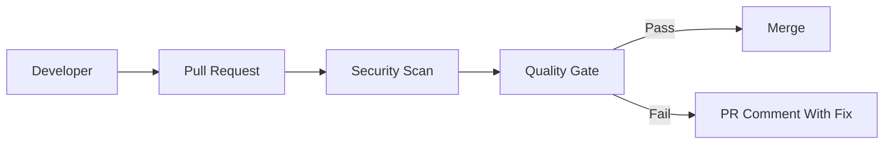

SAST catches insecure code before merge.

In real projects, this is not a theory topic. It affects pull requests, CI jobs, secrets, artifacts, deployments, and sometimes production directly.

<!-- truncate -->

## Why This Matters

Nowadays most deployments are automated using CI/CD pipelines. If pipeline security is weak, attackers can use the same automation that developers use.

For this topic, the practical risk is simple: user input reaches a dangerous function.

## What Usually Goes Wrong

Common mistakes I have seen in real projects:

- SAST is enabled but findings are not triaged.
- Rules are too noisy and developers stop trusting results.
- Only main branch is scanned after merge.
- Security bugs are treated as backlog items.

## Basic Flow



## Practical GitHub Actions Example

```yaml
name: sast-codeql
on: [pull_request]
permissions:
  contents: read
  security-events: write
jobs:
  analyze:
    runs-on: ubuntu-latest
    steps:
      - uses: actions/checkout@v4
      - uses: github/codeql-action/init@v3
        with:
          languages: javascript-typescript
      - uses: github/codeql-action/analyze@v3
```

## Vulnerable Example

```yaml
permissions: write-all
jobs:
  unsafe:
    runs-on: ubuntu-latest
    steps:
      - uses: actions/checkout@master
      - run: echo "$SECRET_VALUE"
```

This is risky because it trusts too much by default. In real teams this usually becomes a problem during a rushed release or when a small PR is approved without checking the pipeline impact.

## Secure Fix

```yaml
name: sast-codeql
on: [pull_request]
permissions:
  contents: read
  security-events: write
jobs:
  analyze:
    runs-on: ubuntu-latest
    steps:
      - uses: actions/checkout@v4
      - uses: github/codeql-action/init@v3
        with:
          languages: javascript-typescript
      - uses: github/codeql-action/analyze@v3
```

## Example PR Output

```text
SAST failed
Finding: user input reaches command execution
Status: PR blocked
Next step: validate input and avoid shell execution
```

## Practical Recommendations

- Start with high confidence rules.
- Tune noisy rules before blocking all PRs.
- Make the check required only after tuning.
- Show result in the pull request.
- Track exceptions with owner, reason, and expiry.

Security should help developers fix issues early. It should not become random CI noise.
