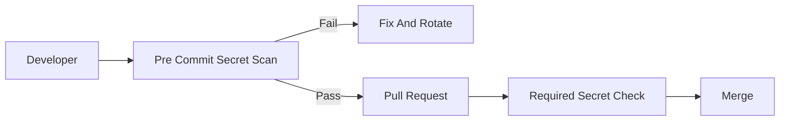

Leaked credentials are one of the fastest ways to get breached.

In real projects, this is not a theory topic. It affects pull requests, CI jobs, secrets, artifacts, deployments, and sometimes production directly.

<!-- truncate -->

## Why This Matters

Nowadays most deployments are automated using CI/CD pipelines. If pipeline security is weak, attackers can use the same automation that developers use.

For this topic, the practical risk is simple: a cloud key is pushed to a public repository.

## What Usually Goes Wrong

Common mistakes I have seen in real projects:

- Secrets are kept in .env files inside the repo.
- Developers trust gitignore but forget older commits.
- Teams do not rotate keys after exposure.
- Secret scan runs in CI but not before commit.

## Basic Flow



## Practical GitHub Actions Example

```yaml
name: secret-scan
on: [pull_request]
permissions:
  contents: read
jobs:
  gitleaks:
    runs-on: ubuntu-latest
    steps:
      - uses: actions/checkout@v4
        with:
          fetch-depth: 0
      - uses: gitleaks/gitleaks-action@v2
        env:
          GITHUB_TOKEN: ${{ secrets.GITHUB_TOKEN }}
```

## Vulnerable Example

```bash
echo "GITHUB_TOKEN=ghp_real_token" >> .env
git add .env
git commit -m "add local config"
```

This is risky because it trusts too much by default. In real teams this usually becomes a problem during a rushed release or when a small PR is approved without checking the pipeline impact.

## Secure Fix

```yaml
name: secret-scan
on: [pull_request]
permissions:
  contents: read
jobs:
  gitleaks:
    runs-on: ubuntu-latest
    steps:
      - uses: actions/checkout@v4
        with:
          fetch-depth: 0
      - uses: gitleaks/gitleaks-action@v2
        env:
          GITHUB_TOKEN: ${{ secrets.GITHUB_TOKEN }}
```

## Example PR Output

```text
Secret scan failed
Finding: AWS key pattern found in config/local.env
Status: PR blocked
Next step: remove secret, rotate key, rerun scan
```

## Practical Recommendations

- Run secret checks in pre-commit and PR.
- Rotate exposed secrets immediately.
- Make the check required only after tuning.
- Show result in the pull request.
- Track exceptions with owner, reason, and expiry.

Security should help developers fix issues early. It should not become random CI noise.
