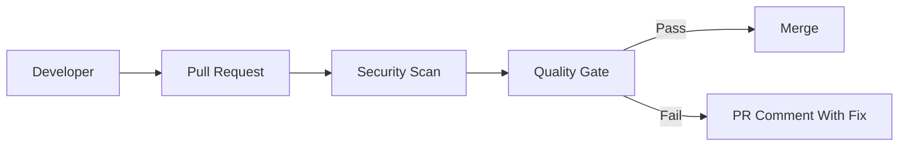

Infrastructure code can expose cloud resources.

In real projects, this is not a theory topic. It affects pull requests, CI jobs, secrets, artifacts, deployments, and sometimes production directly.

<!-- truncate -->

## Why This Matters

Nowadays most deployments are automated using CI/CD pipelines. If pipeline security is weak, attackers can use the same automation that developers use.

For this topic, the practical risk is simple: a Terraform change opens SSH to the internet.

## What Usually Goes Wrong

Common mistakes I have seen in real projects:

- Terraform plan is reviewed only for cost, not security.
- Kubernetes manifests allow privileged workloads.
- Cloud resources are opened to the internet by mistake.
- IaC scanners run but are optional.

## Basic Flow



## Practical GitHub Actions Example

```yaml
name: iac-security
on: [pull_request]
permissions:
  contents: read
  security-events: write
jobs:
  scan-config:
    runs-on: ubuntu-latest
    steps:
      - uses: actions/checkout@v4
      - uses: aquasecurity/trivy-action@0.28.0
        with:
          scan-type: config
          format: sarif
          output: iac.sarif
```

## Vulnerable Example

```hcl
resource "aws_security_group_rule" "ssh" {
  type = "ingress"
  from_port = 22
  to_port = 22
  protocol = "tcp"
  cidr_blocks = ["0.0.0.0/0"]
}
```

This is risky because it trusts too much by default. In real teams this usually becomes a problem during a rushed release or when a small PR is approved without checking the pipeline impact.

## Secure Fix

```yaml
name: iac-security
on: [pull_request]
permissions:
  contents: read
  security-events: write
jobs:
  scan-config:
    runs-on: ubuntu-latest
    steps:
      - uses: actions/checkout@v4
      - uses: aquasecurity/trivy-action@0.28.0
        with:
          scan-type: config
          format: sarif
          output: iac.sarif
```

## Example PR Output

```text
IaC scan failed
Finding: security group allows 0.0.0.0/0 on port 22
Status: PR blocked
Next step: restrict CIDR and rerun workflow
```

## Practical Recommendations

- Scan Terraform and Kubernetes manifests in PR.
- Block internet exposure and privileged workloads.
- Make the check required only after tuning.
- Show result in the pull request.
- Track exceptions with owner, reason, and expiry.

Security should help developers fix issues early. It should not become random CI noise.
