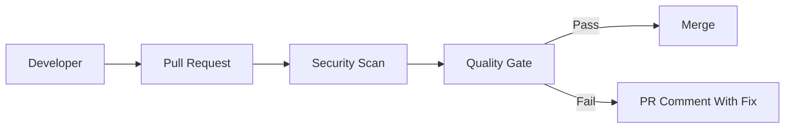

Container images are production artifacts.

In real projects, this is not a theory topic. It affects pull requests, CI jobs, secrets, artifacts, deployments, and sometimes production directly.

<!-- truncate -->

## Why This Matters

Nowadays most deployments are automated using CI/CD pipelines. If pipeline security is weak, attackers can use the same automation that developers use.

For this topic, the practical risk is simple: a vulnerable base image is deployed without scanning.

## What Usually Goes Wrong

Common mistakes I have seen in real projects:

- Images use latest tags.
- Containers run as root.
- Base image vulnerabilities are ignored.
- Image scanning happens after publish, not before.

## Basic Flow



## Practical GitHub Actions Example

```yaml
name: image-security
on: [pull_request]
permissions:
  contents: read
jobs:
  image-scan:
    runs-on: ubuntu-latest
    steps:
      - uses: actions/checkout@v4
      - run: docker build -t app:${{ github.sha }} .
      - uses: aquasecurity/trivy-action@0.28.0
        with:
          image-ref: app:${{ github.sha }}
          severity: HIGH,CRITICAL
          exit-code: "1"
```

## Vulnerable Example

```dockerfile
FROM node:latest
COPY . /app
WORKDIR /app
RUN npm install
USER root
```

This is risky because it trusts too much by default. In real teams this usually becomes a problem during a rushed release or when a small PR is approved without checking the pipeline impact.

## Secure Fix

```yaml
name: image-security
on: [pull_request]
permissions:
  contents: read
jobs:
  image-scan:
    runs-on: ubuntu-latest
    steps:
      - uses: actions/checkout@v4
      - run: docker build -t app:${{ github.sha }} .
      - uses: aquasecurity/trivy-action@0.28.0
        with:
          image-ref: app:${{ github.sha }}
          severity: HIGH,CRITICAL
          exit-code: "1"
```

## Example PR Output

```text
Image scan failed
Finding: critical CVE in base image
Status: PR blocked
Next step: update base image and rebuild
```

## Practical Recommendations

- Pin base images.
- Run containers as non-root where possible.
- Make the check required only after tuning.
- Show result in the pull request.
- Track exceptions with owner, reason, and expiry.

Security should help developers fix issues early. It should not become random CI noise.
