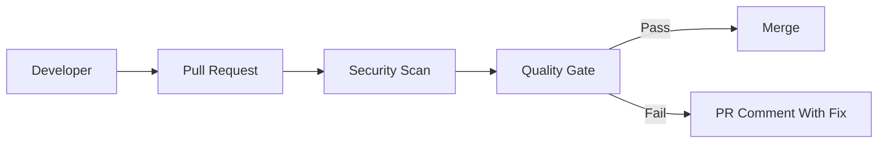

Security checks need merge decisions.

In real projects, this is not a theory topic. It affects pull requests, CI jobs, secrets, artifacts, deployments, and sometimes production directly.

<!-- truncate -->

## Why This Matters

Nowadays most deployments are automated using CI/CD pipelines. If pipeline security is weak, attackers can use the same automation that developers use.

For this topic, the practical risk is simple: critical findings are reported but not blocked.

## What Usually Goes Wrong

Common mistakes I have seen in real projects:

- Scanners run but merge is still allowed.
- Severity threshold is not agreed.
- Exception process is informal.
- Fail-open behavior is not documented.

## Basic Flow



## Practical GitHub Actions Example

```yaml
name: security-quality-gate
on: [pull_request]
permissions:
  contents: read
  pull-requests: write
jobs:
  gate:
    runs-on: ubuntu-latest
    steps:
      - uses: actions/checkout@v4
      - run: node scripts/security-gate.js --fail-on critical --sarif results.sarif
```

## Vulnerable Example

```yaml
permissions: write-all
jobs:
  unsafe:
    runs-on: ubuntu-latest
    steps:
      - uses: actions/checkout@master
      - run: echo "$SECRET_VALUE"
```

This is risky because it trusts too much by default. In real teams this usually becomes a problem during a rushed release or when a small PR is approved without checking the pipeline impact.

## Secure Fix

```yaml
name: security-quality-gate
on: [pull_request]
permissions:
  contents: read
  pull-requests: write
jobs:
  gate:
    runs-on: ubuntu-latest
    steps:
      - uses: actions/checkout@v4
      - run: node scripts/security-gate.js --fail-on critical --sarif results.sarif
```

## Example PR Output

```text
Security check failed
Finding: high confidence issue found
Status: PR blocked
Next step: fix changed file and rerun workflow
```

## Practical Recommendations

- Keep workflow permissions minimum.
- Review workflow changes carefully.
- Make the check required only after tuning.
- Show result in the pull request.
- Track exceptions with owner, reason, and expiry.

Security should help developers fix issues early. It should not become random CI noise.
