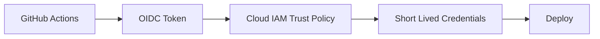

Long-lived cloud keys in CI are risky.

In real projects, this is not a theory topic. It affects pull requests, CI jobs, secrets, artifacts, deployments, and sometimes production directly.

<!-- truncate -->

## Why This Matters

Nowadays most deployments are automated using CI/CD pipelines. If pipeline security is weak, attackers can use the same automation that developers use.

For this topic, the practical risk is simple: a stolen cloud secret is reused outside GitHub.

## What Usually Goes Wrong

Common mistakes I have seen in real projects:

- Cloud keys are stored as long-lived GitHub secrets.
- Deployment role can be used from any branch.
- Environment approvals are missing.
- Cloud trust policy is too wide.

## Basic Flow



## Practical GitHub Actions Example

```yaml
name: cloud-deploy
on:
  push:
    branches: [main]
permissions:
  contents: read
  id-token: write
jobs:
  deploy:
    runs-on: ubuntu-latest
    environment: production
    steps:
      - uses: actions/checkout@v4
      - uses: aws-actions/configure-aws-credentials@v4
        with:
          role-to-assume: arn:aws:iam::123456789012:role/github-deploy
          aws-region: ap-south-1
```

## Vulnerable Example

```yaml
env:
  AWS_ACCESS_KEY_ID: ${{ secrets.AWS_ACCESS_KEY_ID }}
  AWS_SECRET_ACCESS_KEY: ${{ secrets.AWS_SECRET_ACCESS_KEY }}
```

This is risky because it trusts too much by default. In real teams this usually becomes a problem during a rushed release or when a small PR is approved without checking the pipeline impact.

## Secure Fix

```yaml
name: cloud-deploy
on:
  push:
    branches: [main]
permissions:
  contents: read
  id-token: write
jobs:
  deploy:
    runs-on: ubuntu-latest
    environment: production
    steps:
      - uses: actions/checkout@v4
      - uses: aws-actions/configure-aws-credentials@v4
        with:
          role-to-assume: arn:aws:iam::123456789012:role/github-deploy
          aws-region: ap-south-1
```

## Example PR Output

```text
Deployment blocked
Finding: environment approval missing for production
Status: job waiting
Next step: approve from protected environment
```

## Practical Recommendations

- Use short-lived cloud credentials.
- Restrict trust policy by repo, branch, and environment.
- Make the check required only after tuning.
- Show result in the pull request.
- Track exceptions with owner, reason, and expiry.

Security should help developers fix issues early. It should not become random CI noise.
