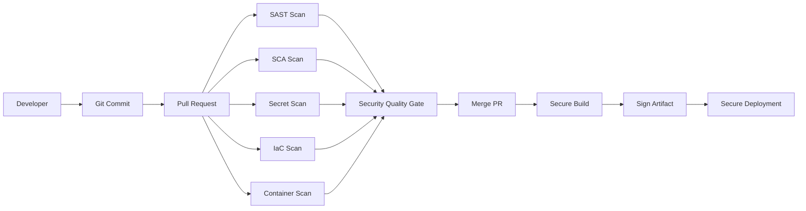

CI/CD security is practical engineering work. In this part, we will learn **Enterprise DevSecOps Architecture** slowly, with real examples and simple explanations.

<!-- truncate -->

## Introduction

Many teams ship fast, but they do not always secure the path from code to production. That path includes source code, pull requests, CI runners, secrets, artifacts, cloud credentials, and deployment approvals.

The mistake is usually not lack of interest. The mistake is unclear ownership and weak automation.

In this article, I will explain the topic like an engineer working with another engineer. We will focus on what breaks in real pipelines and how to fix it without making developers hate the process.

## Real-World Scenario

Imagine a developer opens a pull request. The code works, tests pass, and the team is ready to merge.

But the PR also has one hidden risk:

- a leaked token,
- an unsafe workflow permission,
- a vulnerable dependency,
- a Terraform misconfiguration,
- or an image built from a risky base image.

If security runs only after deployment, this becomes expensive. If security runs clearly in the PR, the fix is usually small.

## Architecture Overview



This flow is the base architecture for the full series.

Security should not live in one place only. It should run in layers:

- local checks for fast feedback,
- pre-commit for obvious mistakes,
- pull request checks for policy,
- CI checks for deeper validation,
- release checks for final control,
- runtime checks for drift.

## Technical Deep Dive

Start with a small workflow. Do not add ten scanners on day one.

```yaml
name: pr-security

on:
  pull_request:
    branches: [main]

permissions:
  contents: read
  security-events: write
  pull-requests: write

jobs:
  security:
    runs-on: ubuntu-latest
    steps:
      - name: Checkout
        uses: actions/checkout@v4

      - name: Run security checks
        run: |
          echo "Run SAST, SCA, secret, IaC, or container checks"
```

For local checks, keep the feedback fast:

```bash
gitleaks detect --source . --redact
semgrep scan --config p/owasp-top-ten
npm audit --audit-level=high
pip-audit
```

For infrastructure checks, use scanner output that developers can understand:

```hcl
resource "aws_security_group_rule" "bad_ssh" {
  type        = "ingress"
  from_port   = 22
  to_port     = 22
  protocol    = "tcp"
  cidr_blocks = ["0.0.0.0/0"]
}
```

This is risky because SSH is open to the internet. The secure version should restrict access.

```hcl
resource "aws_security_group_rule" "restricted_ssh" {
  type        = "ingress"
  from_port   = 22
  to_port     = 22
  protocol    = "tcp"
  cidr_blocks = ["10.0.0.0/8"]
}
```

## Security Risks

Common risks:

- scanners run but nobody reads results,
- PR checks are optional,
- secrets are available to untrusted workflows,
- third-party actions are not pinned,
- self-hosted runners are reused across trust levels,
- SARIF is not uploaded,
- and quality gates are not connected to branch protection.

## Mitigation

Use a simple policy first:

```yaml
security_policy:
  block_on:
    secrets: [critical, high, medium]
    sast: [critical, high]
    sca: [critical]
    iac: [critical, high]
    container: [critical]
  risk_acceptance:
    requires_owner: true
    requires_expiry: true
    max_days: 30
```

This gives developers a clear rule. It also gives AppSec a way to scale without manual review for every finding.

## PR Experience

The PR should show a clean summary.

```text
Security summary

Critical: 0
High: 1
Medium: 4

Status: Blocked
Reason: High severity issue introduced in this PR
Next step: Review SARIF annotation and apply the suggested fix
```

Developers should not search long CI logs. Put findings in annotations, checks, and PR comments.

## Enterprise Recommendations

- Use reusable workflows for common scanners.
- Keep scanner policy in a central repo.
- Use branch protection and rulesets.
- Generate dashboards from SARIF or scanner APIs.
- Tune false positives before enforcing strict gates.
- Use OIDC for cloud deployments.
- Prefer short-lived credentials.
- Review exceptions every month.

## Summary

Enterprise DevSecOps Architecture is part of a bigger secure delivery model.

The goal is not to block developers randomly. The goal is to give fast feedback, enforce important policy, and stop high-risk changes before they reach production.
