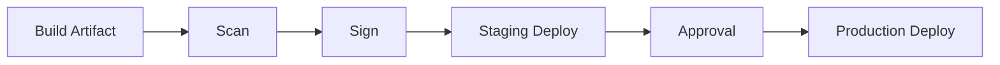

# Secure Deployment Approvals

CD security starts when an artifact is ready to move toward production.

Important controls are deployment approvals, signed artifacts, protected environments, and policy checks before production.

Approvals should be used for production risk, not for every small environment action.

