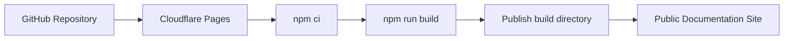

# Cloudflare Pages Deployment

This project is already deployed to GitHub Pages, but it is also ready for Cloudflare Pages.

## Cloudflare Settings

```yaml
cloudflare_pages:
  framework_preset: docusaurus
  build_command: npm run build
  build_output_directory: build
  node_version: 24
```

## Environment Variable

```text
NODE_VERSION=24
```

## Docusaurus URL Settings

For GitHub Pages, keep:

```js
url: 'https://narendra486.github.io'
baseUrl: '/devsecops-blogs/'
```

For a Cloudflare custom domain, use:

```js
url: 'https://your-domain.com'
baseUrl: '/'
```

## Deployment Flow



Cloudflare Pages is a good option when you want custom domains, edge caching, preview deployments, and simple web performance controls.
