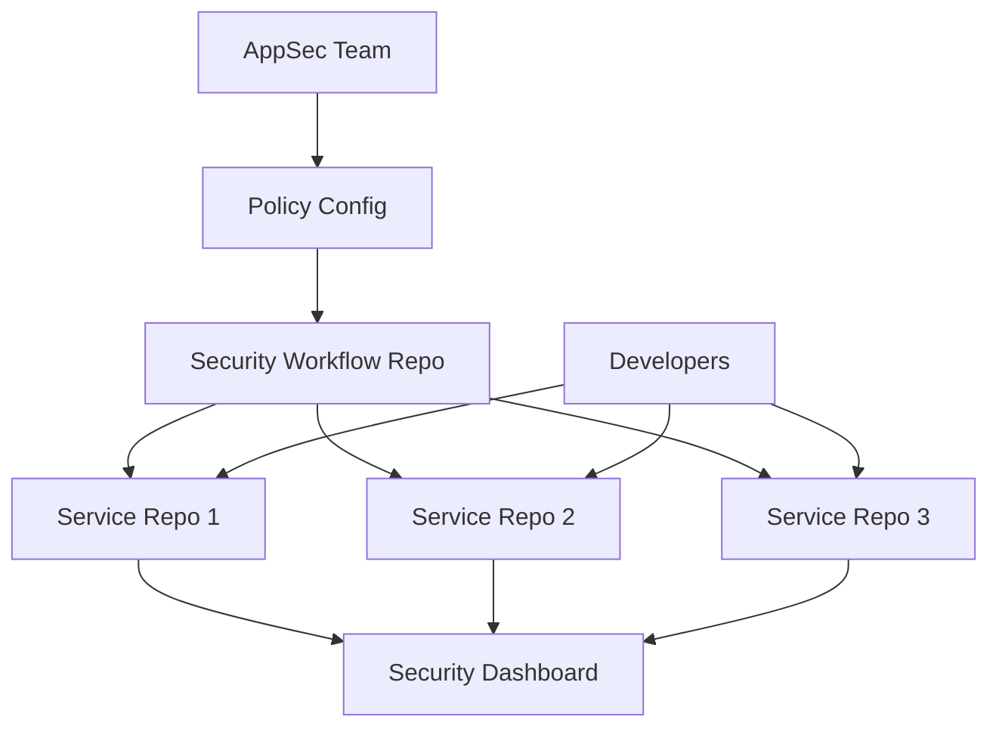

# Scaling AppSec Across Hundreds of Repositories

Enterprise AppSec fails when every repository has a different security setup.

The scalable model is centralized security automation with local ownership.

## Architecture



## Recommended Repos

```text
security-demo-app
  vulnerable app, Dockerfile, Terraform, and GitHub Actions examples

security-workflows
  reusable SAST, SCA, IaC, secrets, container, and quality gate workflows

security-screenshots
  PR screenshots, SARIF examples, and reporting examples
```

## Enterprise Best Practices

- use reusable workflows,
- keep policy as code,
- define severity thresholds,
- make exceptions time-bound,
- centralize reporting,
- publish golden templates,
- and keep developer feedback simple.

