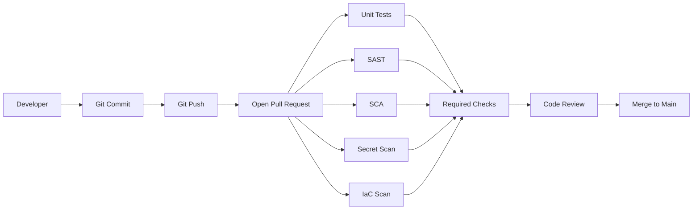

# Git, PR, SCM, Security YAML, and Ruleset Fundamentals

## Why This Foundation Matters

Before learning SAST, SCA, SARIF, quality gates, and GitHub Actions security, we should understand the basic developer flow.

Most CI/CD security starts from this path:

```text
Developer writes code
  -> git commit
  -> git push
  -> pull request
  -> CI/security checks
  -> review
  -> merge
  -> build and deploy
```

If we understand this flow clearly, security becomes easier.

## What Is SCM?

SCM means **Source Code Management**.

In simple words, SCM is the system where source code is stored, versioned, reviewed, and protected.

Common SCM platforms:

- GitHub
- GitLab
- Bitbucket
- Azure Repos

Git is the version control tool. GitHub is the platform that hosts Git repositories and adds pull requests, actions, rulesets, issues, code scanning, and access control.

## Basic Git Flow

### 1. Clone Repository

Developer downloads the repository:

```bash
git clone https://github.com/org/app.git
cd app
```

### 2. Create Branch

Developer should not directly work on `main`.

```bash
git checkout -b feature/add-login-security
```

### 3. Make Code Changes

Developer edits source code, Terraform, Dockerfile, Kubernetes YAML, or GitHub Actions workflow.

### 4. Stage Files

```bash
git add .
```

This means Git is ready to include these files in the next commit.

### 5. Commit

```bash
git commit -m "Add login validation"
```

A commit is a saved snapshot of code changes.

Security point:

- do not commit secrets,
- do not commit `.env` files,
- do not commit private keys,
- avoid committing generated files unless required,
- sign commits when the organization requires it.

### 6. Push

```bash
git push origin feature/add-login-security
```

Push sends your branch to GitHub.

After push, GitHub can run automated checks.

## What Is a Pull Request?

A Pull Request, or PR, is a request to merge code from one branch into another branch.

Example:

```text
feature/add-login-security -> main
```

PR is where teams review:

- code quality,
- tests,
- security findings,
- architecture impact,
- dependency changes,
- infrastructure changes,
- and deployment risk.

## PR Security Flow



The PR is the best place to stop risky changes before they enter `main`.

## Security YAML and Rulesets

Security workflow YAML and GitHub rulesets are important enough to learn separately.

Read this Foundation page next: [What Is a Security YAML File?](./security-yaml-file-fundamentals)

## Summary

Commit, push, PR, SCM, YAML workflows, permissions, and rulesets are the base of CI/CD security.

Once this foundation is clear, topics like SAST, SCA, SARIF, secret scanning, and quality gates become much easier to understand.
