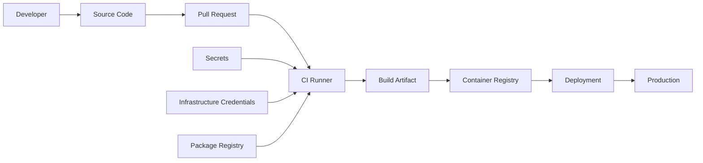

# CI/CD Security Fundamentals

## Problem Statement

Modern teams ship code many times in a week, sometimes many times in a day.

That speed is good for product delivery. But it also means one weak pull request, one leaked secret, one vulnerable dependency, one risky GitHub Actions workflow, or one insecure Docker image can reach production very fast.

CI/CD security exists to reduce that risk without slowing engineering teams unnecessarily.

## What Is CI/CD?

CI/CD is the engineering system that moves code from a developer laptop to production.

```text
Developer laptop
  -> Git commit
  -> Pull request
  -> CI build and test
  -> Security checks
  -> Artifact creation
  -> Deployment approval
  -> Production release
```

CI means Continuous Integration. It validates code changes by building, testing, and scanning them.

CD means Continuous Delivery or Continuous Deployment. It moves approved changes into environments like staging and production.

## Why CI/CD Security Matters

Attackers know that CI/CD systems are powerful.

A pipeline can:

- read source code,
- access secrets,
- build production artifacts,
- push container images,
- deploy to cloud accounts,
- modify infrastructure,
- and write status checks back to GitHub.

If the pipeline is compromised, the attacker may not need to hack production directly. They can use your delivery system to reach production.

## Real Failure Modes

These are common ways security fails in real pipelines:

| Failure | What Happens |
| --- | --- |
| Secret committed to Git | Cloud keys, tokens, or passwords leak into repository history |
| Vulnerable dependency added | Application ships with known CVEs |
| Insecure Terraform merged | Public storage bucket or open security group reaches cloud |
| Weak workflow permissions | Pull request workflow receives more token access than required |
| Unpinned GitHub Action | Third-party action changes unexpectedly |
| No branch protection | Risky code can merge without required checks |
| No quality gate | Scanner finds issues but nothing blocks the merge |

## What Attackers Target

CI/CD attackers usually look for trust boundaries.



Important targets are:

- GitHub tokens,
- cloud credentials,
- package manager tokens,
- Docker registry credentials,
- self-hosted runners,
- build artifacts,
- deployment approvals,
- and reusable workflows.

## The Three Security Layers

In this series, we will use three layers.

```text
Layer 1: Local Developer Security
  Stop simple mistakes before git push.

Layer 2: Pull Request Security
  Enforce policy before merge.

Layer 3: CI/CD Pipeline Security
  Protect build, release, artifact, and deployment systems.
```

This structure is important because each layer has a different job.

Local security gives fast feedback. Pull request security protects the main branch. CI/CD security protects the production delivery path.

## Shared Responsibility Model

CI/CD security is not only an AppSec team responsibility.

| Team | Responsibility |
| --- | --- |
| Developers | Write secure code, fix findings, avoid committing secrets |
| DevOps / Platform | Build secure workflows, runners, permissions, and deployment paths |
| AppSec | Define policy, scanners, gates, triage process, and reporting |
| Product Teams | Prioritize risk fixes with feature work |
| Engineering Leaders | Make security checks part of normal delivery expectations |

If only AppSec owns security, security becomes a ticket queue.

If engineering owns secure delivery with AppSec support, security becomes part of the system.

## Security Maturity Levels

Most organizations move through these levels.

| Level | Behavior |
| --- | --- |
| Level 0 | No automated security checks |
| Level 1 | Manual scans run sometimes |
| Level 2 | Basic scans in CI, mostly informational |
| Level 3 | Pull request checks with clear ownership |
| Level 4 | Quality gates with severity thresholds and exceptions |
| Level 5 | Central reusable workflows, reporting, governance, and continuous improvement |

The target is not to block every issue from day one.

The target is to build a system where risk is visible, feedback is usable, and high-risk changes cannot silently reach production.

## Example: Basic GitHub Actions Security Pipeline

This is not a complete enterprise pipeline. It is a starting point.

```yaml
name: security-checks

on:
  pull_request:
    branches: [main]

permissions:
  contents: read
  security-events: write
  pull-requests: write

jobs:
  secret-scan:
    runs-on: ubuntu-latest
    steps:
      - name: Checkout repository
        uses: actions/checkout@v4

      - name: Run Gitleaks
        uses: gitleaks/gitleaks-action@v2
        env:
          GITHUB_TOKEN: ${{ secrets.GITHUB_TOKEN }}

  dependency-scan:
    runs-on: ubuntu-latest
    steps:
      - name: Checkout repository
        uses: actions/checkout@v4

      - name: Run OSV Scanner
        uses: google/osv-scanner-action/osv-scanner-action@v2
        with:
          scan-args: |-
            --recursive
            ./
```

Notice the intention:

- secrets are checked before merge,
- dependencies are checked before merge,
- permissions are declared explicitly,
- the workflow runs on pull requests,
- and results can be connected to branch protection later.

## Enterprise Recommendation

Do not start by adding ten scanners.

Start with a clear control map:

| Risk | First Control |
| --- | --- |
| Secrets | Gitleaks locally and in PR |
| Vulnerable dependencies | Dependabot and OSV/Snyk/Trivy in PR |
| Insecure code | CodeQL or Semgrep |
| Insecure Terraform/Kubernetes | Checkov, Trivy, tfsec, or KICS |
| Vulnerable container images | Trivy or Grype |
| Weak pipeline permissions | GitHub Actions hardening and branch protection |

After that, add quality gates slowly.

## Best Practices

- Keep fast checks close to developers.
- Keep blocking checks in pull requests.
- Keep deep checks in CI.
- Upload SARIF where possible.
- Make findings visible in the developer workflow.
- Define severity thresholds clearly.
- Allow risk acceptance, but make it visible and time-bound.
- Use reusable workflows for scale.
- Protect main branch with required checks.

