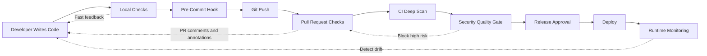

# Shift Left Security

## Problem Statement

Many teams find security issues only after code is already merged.

At that point, the developer has moved to another task, the feature branch is gone, the context is lost, and the fix becomes expensive.

Shift left security means we move useful security feedback earlier in the engineering flow.

It does not mean every security tool should run on the developer laptop. That will create noise and slow down work.

Good shift left is about placing the right check at the right stage.

## Why It Matters

A secret found before commit is a small fix.

A secret found after push is a rotation task.

A secret found after public exposure is an incident.

The same logic applies to vulnerable dependencies, insecure Terraform, and risky application code. Early feedback is cheaper, faster, and easier to fix.

## Shift Left Architecture



This is the practical model:

- local checks help the developer immediately,
- pre-commit blocks obvious mistakes,
- pull request checks enforce team policy,
- CI checks run deeper validation,
- release gates protect production,
- runtime checks detect drift and missed issues.

## Where Security Should Run

| Stage | Purpose | Example Controls |
| --- | --- | --- |
| Local | Fast feedback | Semgrep local, npm audit, pip-audit |
| Pre-Commit | Block obvious mistakes | Gitleaks, detect-secrets, basic linting |
| Pull Request | Enforce policy | CodeQL, Semgrep, SCA, IaC scanning |
| CI Pipeline | Full deep scan | Container scan, SBOM, integration checks |
| Release | Final validation | Signing, approvals, provenance |
| Runtime | Detect drift | CSPM, Kubernetes policy, runtime alerts |

This table is important for enterprise teams.

If everything runs locally, developers will disable tools.

If everything runs only after merge, security will always be late.

## Example: Local Secret Scan Before Push

Install Gitleaks and run it locally:

```bash
gitleaks detect --source . --redact
```

A developer can also scan only staged changes through pre-commit:

```yaml
repos:
  - repo: https://github.com/gitleaks/gitleaks
    rev: v8.24.2
    hooks:
      - id: gitleaks
```

This prevents simple credential leaks before the code reaches GitHub.

## Example: Pull Request Enforcement

Local checks are helpful, but organizations cannot depend only on local checks.

Pull request checks are where policy becomes real.

```yaml
name: pull-request-security

on:
  pull_request:
    branches: [main]

permissions:
  contents: read
  security-events: write
  pull-requests: write

jobs:
  sast:
    name: SAST with Semgrep
    runs-on: ubuntu-latest
    steps:
      - uses: actions/checkout@v4

      - name: Run Semgrep
        uses: semgrep/semgrep-action@v1
        with:
          config: p/owasp-top-ten
```

In a mature setup, this workflow should:

- annotate risky code,
- upload SARIF where supported,
- comment on the pull request,
- fail only on agreed severity levels,
- and allow documented exception handling.

## Developer Experience Matters

Bad security feedback says:

```text
Security scan failed.
```

Good security feedback says:

```text
High severity SQL injection risk found in src/routes/user.js:42.
User input reaches database query without parameterization.
Fix: use parameterized query or ORM binding.
Policy: high severity SAST findings block pull requests.
```

Developers need location, reason, impact, and fix guidance.

Without that, security becomes friction.

## False Positives

False positives are not a small issue. They decide whether developers trust the system.

A good process should support:

- inline suppression with reason,
- AppSec review for recurring suppressions,
- baseline files for legacy findings,
- severity tuning,
- rule ownership,
- and time-bound risk acceptance.

Example Semgrep ignore:

```javascript
// nosemgrep: javascript.express.security.audit.xss.direct-response-write
// Reason: response is static text, no user input reaches this sink.
res.send('health ok');
```

Do not allow silent ignores without reason. That creates blind spots.

## Enterprise Recommendations

For a small team, start with local secret scanning and PR checks.

For a growing organization, move security logic into reusable workflows.

```yaml
name: app-security

on:
  pull_request:

jobs:
  security:
    uses: your-org/security-workflows/.github/workflows/pr-security.yml@v1
    permissions:
      contents: read
      security-events: write
      pull-requests: write
```

This gives platform and AppSec teams a central place to improve controls without copying YAML into every repository.

## Best Practices

- Start with secrets, dependencies, and high-confidence SAST rules.
- Run fast checks locally.
- Run enforceable checks on pull requests.
- Keep deep scans in CI.
- Use SARIF for code scanning visibility.
- Use PR comments for developer-friendly feedback.
- Block only what the team can explain and support.
- Review false positives regularly.
- Centralize workflows when many repositories need the same controls.

