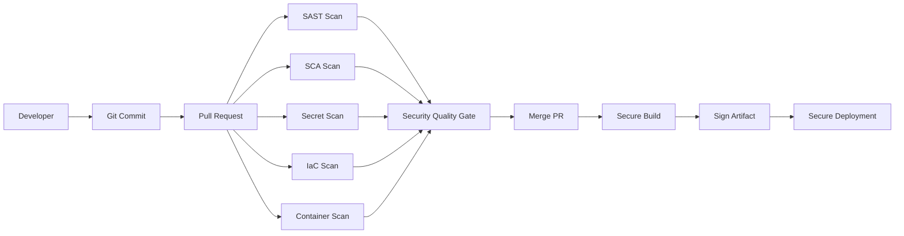

# Introduction

Author: Narendra Palla  
Role: Product Security Engineer

## Practical CI/CD Security for Real Engineering Teams

This platform teaches CI/CD Security, DevSecOps, SCM Security, GitHub Actions Security, Application Security, and Software Supply Chain Security in a practical way.

The goal is simple: help developers, DevOps engineers, platform engineers, AppSec engineers, security champions, and students understand how modern software delivery systems fail and how to secure them properly.

This is not random tool documentation.

The content explains:

- why security matters,
- how attackers abuse CI/CD systems,
- how developers actually work,
- where security checks should run,
- how pull request feedback should look,
- and how enterprises scale DevSecOps across many repositories.

## Why It Matters

In real teams, security fails when it is added too late or when tools give noisy feedback. CI/CD security should be close to the developer workflow, but it should also be strong enough for enterprise governance.

Common failure points:

- secrets reach Git history,
- vulnerable dependencies merge quietly,
- pull requests do not have required security checks,
- workflows run with broad permissions,
- containers are deployed without image scanning,
- cloud deployments use long-lived secrets,
- and security findings are hidden inside CI logs.

## Architecture Overview



The main idea is simple. Fast checks should run early. Deep checks should run in CI. High-risk findings should block pull requests or releases. Developers should see clear feedback in the PR.

## Learning Path

Start here:

1. [CI/CD Security Fundamentals](./cicd-security-fundamentals)
2. [Shift Left Security](./shift-left-security)
3. [SCM Security](./scm-security)
4. [GitHub Actions Security](./github-actions-security)
5. [Pull Request Security](./pull-request-security)
6. [Security Quality Gates](./security-quality-gates)
7. [Supply Chain Security](./supply-chain-security)
8. [Enterprise DevSecOps](./enterprise-devsecops)

## Platform Configuration Example

```yaml
platform:
  name: Enterprise CI/CD Security
  author: Narendra Palla
  role: Product Security Engineer
  focus:
    - CI/CD Security
    - DevSecOps
    - SCM Security
    - GitHub Actions Security
    - Application Security
    - Software Supply Chain Security
  hosting:
    github_pages: true
    cloudflare_pages_ready: true
```

## Vulnerable Example

```yaml
permissions: write-all

jobs:
  unsafe-job:
    runs-on: ubuntu-latest
    steps:
      - uses: actions/checkout@master
      - run: echo "$CLOUD_SECRET"
```

Problems in this example:

- workflow token is too powerful,
- action is not pinned to a safe version or SHA,
- secret handling is careless,
- and there is no clear policy gate.

## Secure Example

```yaml
permissions:
  contents: read
  security-events: write

jobs:
  secure-job:
    runs-on: ubuntu-latest
    steps:
      - uses: actions/checkout@v4
      - name: Run controlled check
        run: |
          echo "Run scanner with least privilege"
```

## PR Experience

A good PR security comment should not only say "scan failed".

```text
Security check failed

High: 1
Medium: 3

Blocking reason:
- High severity issue affects code changed in this PR.

Next step:
- Review inline SARIF annotation.
- Apply suggested fix.
- Re-run the workflow.
```

## Enterprise Recommendations

- Use required checks on protected branches.
- Upload SARIF for code-level findings.
- Use PR comments for readable summaries.
- Keep severity thresholds clear.
- Allow risk acceptance only with owner, reason, and expiry.
- Move common logic into reusable workflows.
- Track findings centrally across repositories.

## Summary

Introduction is not only a tool topic. It is part of secure software delivery. Start with the risk, place the control in the right CI/CD stage, and make feedback easy for developers to act on.
