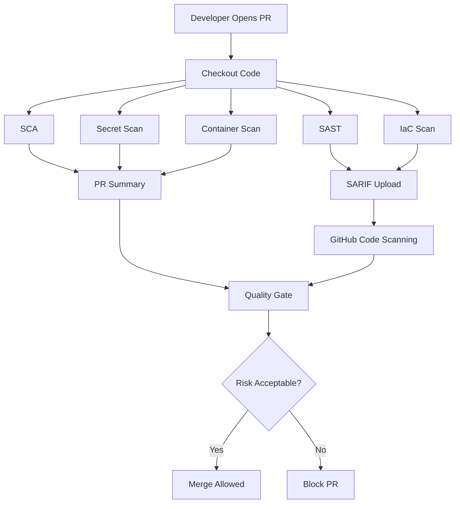

# Building Secure Pull Request Pipelines

Pull requests are the most important enforcement point in CI/CD security.

This is where developers already expect review, tests, and feedback. Security should join that workflow instead of sitting outside it.

## PR Security Flow



## Scanner Purpose

| Scanner Type | Purpose |
| --- | --- |
| SAST | Finds insecure code patterns |
| SCA | Finds vulnerable dependencies |
| Secret Scanning | Prevents credential leaks |
| IaC Scanning | Finds cloud and Kubernetes misconfigurations |
| Container Scanning | Finds OS and package vulnerabilities in images |

## Example PR Workflow

```yaml
name: pr-security

on:
  pull_request:
    branches: [main]

permissions:
  contents: read
  security-events: write
  pull-requests: write

jobs:
  codeql:
    name: CodeQL
    runs-on: ubuntu-latest
    steps:
      - uses: actions/checkout@v4
      - uses: github/codeql-action/init@v3
        with:
          languages: javascript-typescript
      - uses: github/codeql-action/analyze@v3

  trivy:
    name: Trivy filesystem scan
    runs-on: ubuntu-latest
    steps:
      - uses: actions/checkout@v4
      - uses: aquasecurity/trivy-action@master
        with:
          scan-type: fs
          scan-ref: .
          severity: HIGH,CRITICAL
          format: sarif
          output: trivy-results.sarif

      - uses: github/codeql-action/upload-sarif@v3
        with:
          sarif_file: trivy-results.sarif
```

## What A Good PR Comment Should Say

```text
Security scan summary

Critical: 0
High: 2
Medium: 7

Blocking reason:
- 2 high dependency vulnerabilities are reachable in production dependencies.

Next step:
- Upgrade express from 4.17.1 to a patched version.
- Re-run the PR check.
```

This is better than asking developers to download artifacts and search logs.

## Enterprise Recommendations

- Make PR security checks required in branch protection.
- Upload SARIF for scanners that support it.
- Use PR comments for summary and next steps.
- Keep severity thresholds clear.
- Baseline legacy findings before enforcing new rules.
- Use reusable workflows for consistency.
- Track exceptions with expiry dates.

