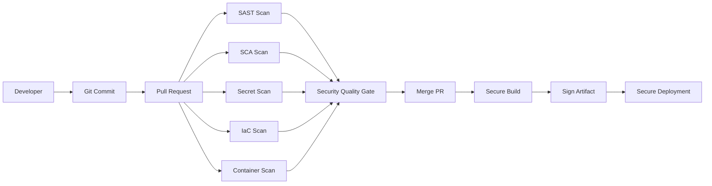

# Secret Scanning

## What This Page Covers

Prevent API keys, cloud credentials, GitHub tokens, SSH keys, and passwords from leaking.

This page is written in simple engineering language. The goal is to help developers and security teams understand the real problem, where it fails in CI/CD, and how to fix it with practical controls.

## Why It Matters

In real teams, security fails when it is added too late or when tools give noisy feedback. CI/CD security should be close to the developer workflow, but it should also be strong enough for enterprise governance.

Common failure points:

- secrets reach Git history,
- vulnerable dependencies merge quietly,
- pull requests do not have required security checks,
- workflows run with broad permissions,
- containers are deployed without image scanning,
- cloud deployments use long-lived secrets,
- and security findings are hidden inside CI logs.

## Architecture Overview



The main idea is simple. Fast checks should run early. Deep checks should run in CI. High-risk findings should block pull requests or releases. Developers should see clear feedback in the PR.

## Key Topics

- Gitleaks
- GitHub Secret Scanning
- TruffleHog
- Secret rotation
- Repository history

## Practical YAML Example

```yaml
name: secret-scanning

on:
  pull_request:
    branches: [main]
  workflow_dispatch:

permissions:
  contents: read
  security-events: write
  pull-requests: write

jobs:
  security-check:
    runs-on: ubuntu-latest
    steps:
      - name: Checkout repository
        uses: actions/checkout@v4

      - name: Run security control
        run: |
          echo "Run Secret Scanning checks here"
          echo "Upload SARIF or comment on PR when possible"
```

## Vulnerable Example

```yaml
permissions: write-all

jobs:
  unsafe-job:
    runs-on: ubuntu-latest
    steps:
      - uses: actions/checkout@master
      - run: echo "$CLOUD_SECRET"
```

Problems in this example:

- workflow token is too powerful,
- action is not pinned to a safe version or SHA,
- secret handling is careless,
- and there is no clear policy gate.

## Secure Example

```yaml
permissions:
  contents: read
  security-events: write

jobs:
  secure-job:
    runs-on: ubuntu-latest
    steps:
      - uses: actions/checkout@v4
      - name: Run controlled check
        run: |
          echo "Run scanner with least privilege"
```

## PR Experience

A good PR security comment should not only say "scan failed".

```text
Security check failed

High: 1
Medium: 3

Blocking reason:
- High severity issue affects code changed in this PR.

Next step:
- Review inline SARIF annotation.
- Apply suggested fix.
- Re-run the workflow.
```

## Enterprise Recommendations

- Use required checks on protected branches.
- Upload SARIF for code-level findings.
- Use PR comments for readable summaries.
- Keep severity thresholds clear.
- Allow risk acceptance only with owner, reason, and expiry.
- Move common logic into reusable workflows.
- Track findings centrally across repositories.

## Summary

Secret Scanning is not only a tool topic. It is part of secure software delivery. Start with the risk, place the control in the right CI/CD stage, and make feedback easy for developers to act on.
