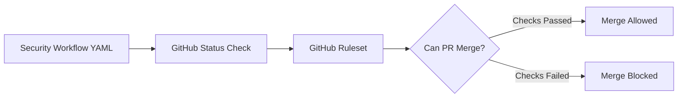

# What Is a Security YAML File?

In GitHub Actions, automation is written in YAML files.

A **security YAML file** is a GitHub Actions workflow that runs security checks automatically.

It can run checks like:

- SAST,
- SCA,
- secret scanning,
- IaC scanning,
- container scanning,
- SARIF upload,
- PR comments,
- and security quality gates.

## Where To Put Security YAML Files

GitHub Actions workflow files must be stored here:

```text
.github/workflows/
```

Example file paths:

```text
.github/workflows/pr-security.yml
.github/workflows/secret-scan.yml
.github/workflows/iac-security.yml
.github/workflows/container-security.yml
```

If the file is not inside `.github/workflows/`, GitHub Actions will not treat it as a workflow.

## Basic YAML Syntax

YAML uses indentation.

Spaces matter.

Good:

```yaml
name: pr-security

on:
  pull_request:
    branches: [main]
```

Bad:

```yaml
name: pr-security

on:
pull_request:
branches: [main]
```

The bad example is wrong because `pull_request` and `branches` are not indented properly.

## Basic GitHub Actions Security Workflow

Create this file:

```text
.github/workflows/pr-security.yml
```

Add this content:

```yaml
name: pr-security

on:
  pull_request:
    branches: [main]
  workflow_dispatch:

permissions:
  contents: read
  security-events: write
  pull-requests: write

jobs:
  security-checks:
    name: PR Security Checks
    runs-on: ubuntu-latest

    steps:
      - name: Checkout repository
        uses: actions/checkout@v4

      - name: Secret scan placeholder
        run: |
          echo "Run Gitleaks or TruffleHog here"

      - name: SAST placeholder
        run: |
          echo "Run CodeQL, Semgrep, Snyk Code, or SonarQube here"

      - name: Dependency scan placeholder
        run: |
          echo "Run OSV Scanner, Trivy, Snyk, or Dependabot review here"
```

## What Each YAML Section Means

```yaml
name: pr-security
```

This is the workflow name shown in GitHub Actions and PR checks.

```yaml
on:
  pull_request:
    branches: [main]
```

This tells GitHub to run the workflow when a PR targets `main`.

```yaml
workflow_dispatch:
```

This allows a developer or security engineer to run the workflow manually.

```yaml
permissions:
  contents: read
  security-events: write
  pull-requests: write
```

This controls what the workflow token can do.

## What Permissions Are Needed?

Use least privilege.

Do not use this unless there is a strong reason:

```yaml
permissions: write-all
```

Better:

```yaml
permissions:
  contents: read
```

Add more only when needed.

Common permissions:

| Permission | Why It Is Needed |
| --- | --- |
| `contents: read` | Checkout and read repository code |
| `security-events: write` | Upload SARIF to GitHub Code Scanning |
| `pull-requests: write` | Add PR comments or review comments |
| `checks: write` | Create or update GitHub check runs |
| `id-token: write` | Use OIDC for cloud authentication |

Example for SARIF upload:

```yaml
permissions:
  contents: read
  security-events: write
```

Example for PR comments:

```yaml
permissions:
  contents: read
  pull-requests: write
```

Example for cloud deployment with OIDC:

```yaml
permissions:
  contents: read
  id-token: write
```

## Insecure Workflow Example

```yaml
name: unsafe-security-workflow

on:
  pull_request:

permissions: write-all

jobs:
  scan:
    runs-on: ubuntu-latest
    steps:
      - uses: actions/checkout@master
      - run: echo "${{ secrets.AWS_SECRET_ACCESS_KEY }}"
```

Problems:

- `write-all` gives too much access,
- `checkout@master` is not a stable version,
- secrets are handled carelessly,
- no clear scanner output,
- no SARIF,
- no quality gate.

## Better Workflow Example

```yaml
name: pr-security

on:
  pull_request:
    branches: [main]

permissions:
  contents: read
  security-events: write
  pull-requests: write

jobs:
  scan:
    runs-on: ubuntu-latest
    steps:
      - name: Checkout repository
        uses: actions/checkout@v4

      - name: Run security scanner
        run: |
          echo "Run scanner here"

      - name: Upload SARIF placeholder
        run: |
          echo "Upload SARIF when scanner supports it"
```

## What Are GitHub Rulesets?

Rulesets are GitHub controls that protect branches and tags.

They help enforce:

- pull requests before merge,
- required status checks,
- required approvals,
- CODEOWNERS review,
- signed commits,
- linear history,
- block force push,
- block branch deletion,
- restrict who can push.

Rulesets are useful because security should not depend only on team discipline. It should be enforced by the platform.

## Example Ruleset Policy

```yaml
ruleset:
  target: branch
  branch: main
  enforcement: active
  rules:
    require_pull_request: true
    required_approvals: 1
    require_codeowners_review: true
    require_status_checks:
      - pr-security
      - tests
      - secret-scan
    block_force_push: true
    block_deletion: true
```

This YAML is a documentation example. In GitHub UI, you configure it from:

```text
Repository
  -> Settings
  -> Rules
  -> Rulesets
```

For organizations:

```text
Organization
  -> Settings
  -> Repository
  -> Rulesets
```

## How Rulesets Work With Security YAML

Security YAML creates checks.

Rulesets make those checks required.



Without rulesets, security checks may run but developers may still merge.

With rulesets, security checks become part of the merge policy.

## Beginner Checklist

- Put workflow files in `.github/workflows/`.
- Use `.yml` or `.yaml` extension.
- Run security checks on `pull_request`.
- Start with `contents: read`.
- Add `security-events: write` only when uploading SARIF.
- Add `pull-requests: write` only when commenting on PRs.
- Avoid `permissions: write-all`.
- Protect `main` with rulesets.
- Make important checks required.
- Keep security feedback readable for developers.

## Summary

A security YAML file is the automation layer that runs security checks in GitHub Actions.

Rulesets make those checks required before merge.
